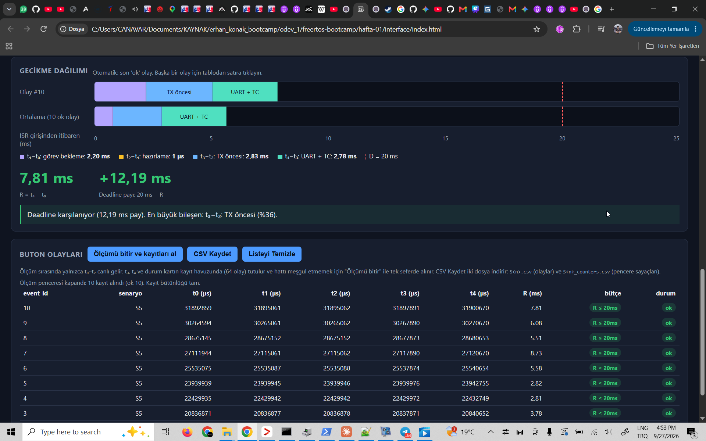
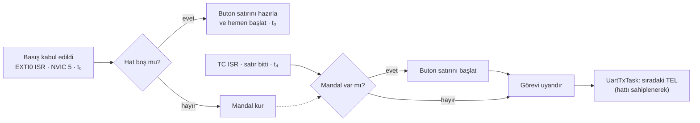

# PressTrace FastPath — Görev Önceliklerine Dokunmadan Yük Altında Deterministik Buton Yanıtı

**STM32F407VG Discovery · FreeRTOS V11.1.0+ · IAR EWARM 9.70.4**

PressTrace FastPath, [PressTrace](https://github.com/ardagmrkc/presstrace-stm32)'in devamıdır.
PressTrace, üç görevli bir FreeRTOS sisteminde telemetri yükü ve ek CPU işi arttıkça buton yanıt
süresinin (`R = t₄ − t₀`) nasıl bozulduğunu ölçtü. En ağır senaryoda (S5: 100 Hz telemetri + 5 ms
iş) sistem doyuma girdi: R 165 ms'ye çıktı ve basışların üçte biri düştü.

Bu depo o sonucun **kök nedenini** ölçümle ayırır ve iki sert kısıt altında giderir:
- **Görev öncelikleri değişmeyecek.**
- **Baud sabit kalacak.**

Çözüm, butonun zaman kritik yolunu görev düzleminden NVIC düzlemine taşıyan bir **UART hakemi**dir.

> ### Sonuç: S5 (100 Hz telemetri + 5 ms CPU işi)
>
> | | PressTrace (115200) | **FastPath (230400)** | Değişim |
> |---|---|---|---|
> | R en büyük | 165,3 ms | **5,51 ms** | 30 kat |
> | R ortalama | 113,7 ms | **3,33 ms** | 34 kat |
> | Jitter (en büyük − en küçük) | 135,9 ms | **2,72 ms** | 50 kat |
> | Başarılı / düşen | 20 / 10 | **30 / 0** | kayıp yok |
> | 20 ms bütçesini aşan | 20 | **0** | |
>
> Değişmeyenler: görev öncelikleri (Telemetry 3 > Button 2 > UartTx 1), NVIC öncelikleri (5),
> 64 baytlık satır biçimi, ölçüm yöntemi ve analiz hattı.

---

## İçindekiler

1. [Problem](#1-problem)
2. [Kısıtlar](#2-kısıtlar)
3. [Kök neden analizi](#3-kök-neden-analizi)
4. [Tasarım: UART hakemi ve hızlı yol](#4-tasarım-uart-hakemi-ve-hızlı-yol)
5. [Doğrulama](#5-doğrulama)
6. [Sonuçlar](#6-sonuçlar)
7. [Bilinçli ödünleşimler ve sınırlar](#7-bilinçli-ödünleşimler-ve-sınırlar)
8. [Derleme, çalıştırma ve depo yapısı](#8-derleme-çalıştırma-ve-depo-yapısı)
9. [Referanslar ve katkılar](#9-referanslar-ve-katkılar)

---

## 1. Problem

Sistem üç görevden oluşur ve önceliklerinin sırası **kasıtlıdır**. Deney, yüksek öncelikli
periyodik işin düşük öncelikli servisi nasıl geciktirdiğini görünür kılmak için tasarlandı:

| Görev | Öncelik | İş |
|---|---|---|
| TelemetryTask | 3 | 10/50/100 Hz sıcaklık satırı (TEL); S4/S5'te periyot başına 2/5 ms ek CPU işi |
| ButtonTask | 2 | Buton olayından 64 baytlık cevap satırını (BTN) kurar |
| UartTxTask | 1 | UART'ı sürer, t₃/t₄'ü ölçer, ölçüm kayıtlarını tutar |

Beş zaman damgası aynı 32 bit, 1 MHz TIM2 sayacından alınır. R dört aşamanın toplamı olarak
okunur: `t₁−t₀` görev bekleme, `t₂−t₁` hazırlama, `t₃−t₂` TX öncesi bekleme, `t₄−t₃` UART + TC.

PressTrace'in 115200 baud ölçümlerinde (25 Eylül 2026) S0–S4 bütçede kaldı. S5'te ise sistem
doyuma girdi:

- 5 + 5,56 = 10,56 ms > 10 ms: UART satırı telemetri işi sürerken bitiyordu. En düşük öncelikli
  UartTxTask bir sonraki satırı ancak iş bitince başlatabiliyordu. Periyotta tek bir "başlatma
  hakkı" vardı ve bu, TEL üretim hızına eşitti (ρ = 1).
- Her basış kuyruğa kalıcı bir satır ekledi: R 29 ms'den 165 ms'ye basamak basamak yükseldi,
  16'lık kuyruk doldu, 10 basış düştü.

Ayrıntı ve ham veri: [presstrace-stm32 / analysis/report.md](https://github.com/ardagmrkc/presstrace-stm32/blob/main/analysis/report.md).

## 2. Kısıtlar

| Kısıt | Neden |
|---|---|
| Görev öncelikleri **değişmez** (3 / 2 / 1) | Deneyin tanımı. Önceliği değiştirmek problemi çözmez, deneyi başka bir deneye çevirir |
| Baud **sabittir** (230400) | Hat hızı deneyin sabitidir |
| 64 baytlık ASCII satır biçimi **değişmez** | Satır süresi deterministik kalmalı; arayüz ve analiz aynı biçime dayanır |
| NVIC öncelikleri **değişmez** (EXTI0 = USART2 = 5) | 5, FreeRTOS `FromISR` API'lerinin çağrılabildiği sınırdır |
| Yalnızca **gerektiği kadar ekleme** yapılır | Mevcut ölçüm, kayıt ve analiz zinciri korunur |

## 3. Kök neden analizi

### 3.1 Birinci adım: hat süresi (115200 → 230400)

230400'de satır süresi 5,56 ms'den 2,78 ms'ye iner. S5'te 5 + 2,78 = 7,78 ms < 10 ms olur:
satır, bir sonraki iş başlamadan biter ve doyum koşulu ortadan kalkar. Ara ölçümde (bu
değişiklikten sonra, hızlı yoldan önce) S5'te kayıp sıfıra indi, ama R hâlâ 2,81–8,73 ms
aralığında dağılıyordu:



*Ara ölçüm, S5, 230400, görev tabanlı yanıt yolu. Olay 10: görev bekleme 2,20 ms + TX öncesi
2,83 ms + hat 2,78 ms = 7,81 ms.*

### 3.2 İkinci adım: kalan gecikmenin ayrıştırılması

Ara ölçümdeki olaylar üç gruba ayrılır:

| Grup | Olaylar | t₁−t₀ | t₃−t₂ | R |
|---|---|---|---|---|
| **Basış telemetri işinin içinde** | 7, 9, 10 | 0,47 – 3,12 ms | **2,83 ms** (üçünde de aynı) | 6,08 – 8,73 ms |
| Basış anında hatta TEL var | 3, 6, 8 | ~0,01 ms | 0,99 – 2,79 ms | 3,78 – 5,58 ms |
| Hat boş | 4, 5 | ~0,01 ms | ~0,03 ms | 2,81 – 2,82 ms |

Asıl sorun birinci grup. Orada iki gecikme art arda ekleniyor:

1. **Görev bekleme.** ButtonTask (2), TelemetryTask'ın (3) işi bitene kadar CPU alamıyor.
   Kanıt: üç olayda da t₁'in son dört hanesi `…5061`; ButtonTask tam iş bittiği anda çalışıyor.
2. **FIFO sırası.** İş bitince önce TEL kuyruğa giriyor, ButtonTask ondan sonra çalışıyor; buton
   satırı her seferinde o TEL'in arkasına düşüyor. Kanıt: `t₃ − t₂` üç olayda da tam bir satır
   süresi, 2,83 ms.

**Belirleyici gözlem:** Telemetri işi sürerken **hat boştur**. 230400'de TEL satırı işten sonra
başlayıp 2,78 ms'de bitiyor ve bir sonraki işe taşmıyor. Hattı o sırada kullanamayan şey
donanım değil, **görevlerin CPU'ya erişememesi**. NVIC'teki kesmeler ise görev ne yaparsa yapsın
çalışıyor. Buton yanıtının hatta başlatılması görev düzleminden kesme düzlemine taşınırsa,
birinci grubun R'si hat süresine (~2,8 ms) iner, hem de görev önceliklerine dokunmadan.

## 4. Tasarım: UART hakemi ve hızlı yol



Hattın kime ait olduğuna artık [uart.c](firmware/Core/Src/uart.c)'deki tek bir hakem karar
veriyor: hat ya boş, ya görevde, ya da butonda.

- **EXTI0 kesmesi:** Hat boşsa buton satırını hazırlayıp hemen başlatır; meşgulse mandal kurar.
- **TC kesmesi:** Önce t₄'ü alır. Mandal varsa buton satırını **görevi uyandırmadan önce**
  başlatır, görevi en son uyandırır.
- **Görev yolu:** "Hat boş mu, mandal yok mu?" kontrolü ile sahiplenme tek bir kritik bölgede
  yapılır; hat meşgulse görev hata vermez, hattın boşalmasını bekler.
- **ButtonTask yedek yoldur:** Mandal doluyken gelen basışlar ve açılışta UART hazır değilken
  gelen basışlar eskisi gibi ButtonTask üzerinden gider.

### 4.1 Değişmezler (invariant)

| # | Değişmez | Nasıl sağlanıyor |
|---|---|---|
| D1 | Hatta en fazla bir satır vardır | Sahiplik tek bir değişkende (`s_owner`) tutulur |
| D2 | Sahiplik kararı atomiktir, baytlar karışamaz | EXTI0 ve USART2 aynı NVIC önceliğinde (5), birbirini kesemez. Görev tarafı `taskENTER_CRITICAL` ile 5–15 önceliklerini maskeler |
| D3 | TEL, bekleyen bir butonun önüne geçemez | TC ISR'si önce mandalı başlatır, görevi sonra uyandırır; görev mandal varken hattı alamaz |
| D4 | Hattaki sıra = sıra numarası (seq) sırası | seq, satır hatta başlatılırken tek bir atomik noktada artar |
| D5 | Kayıt havuzunun tek sahibi UartTxTask'tır | Hızlı yolun sonucu TC ISR'sinden kuyrukla iletilir (`MSG_BTN_DONE`) |
| D6 | Hiçbir basış kaybolmaz | Mandal → yedek yol (ButtonTask) → düşen olay kaydı zinciri |
| D7 | Hat hiçbir hata durumunda kilitli kalmaz | TC'si 50 ms içinde gelmeyen aktarım iptal edilir ve `timeout` olarak kayda geçer |

### 4.2 Değerlendirilen ve reddedilen seçenekler

| Seçenek | Neden reddedildi |
|---|---|
| ButtonTask / UartTxTask önceliğini yükseltmek | Kısıt. Ayrıca deneyin ölçtüğü etkiyi yok eder, çözmez |
| Baud'u daha da artırmak (460800) | Kısıt. Kalan 5 ms üstü durumları giderir ama sorunu değil, belirtiyi hedefler |
| Hattaki TEL'i yarıda kesip butonu öne almak | Yarım satır üretir; arayüz bunu hatalı satır sayar, ölçüm bütünlüğü bozulur |
| Buton satırını sabit gecikmeyle göndermek | Jitter'ı sıfırlar ama ortalama R'yi en kötü duruma (~5,6 ms) çeker |
| Ek işi ayrı, düşük öncelikli bir göreve taşımak | Senaryonun anlamını değiştirir: S4/S5 artık "yüksek öncelikli CPU yükü" olmaz |

### 4.3 Kod haritası

| Dosya | Değişiklik |
|---|---|
| [uart.c](firmware/Core/Src/uart.c) / [uart.h](firmware/Core/Inc/uart.h) | Hakem, hızlı yol, TC kesmesinde yeni sıra, takılma koruması |
| [button.c](firmware/Core/Src/button.c) | Kesme önce hızlı yolu dener, reddedilirse ButtonTask'a düşer |
| [uart_tx_task.c](firmware/Core/Src/uart_tx_task.c) | Sahiplenerek gönderim, hızlı yol sonuçlarının kayda yazılması, yeni sayaçlar |
| [protocol.h](firmware/Core/Inc/protocol.h) / [protocol.c](firmware/Core/Src/protocol.c) | İç mesaj `MSG_BTN_DONE`; sayaçlar `btn_direct`, `btn_latched`, `btn_fallback`, `btn_result_lost` |
| [tests/host/](tests/host/) | Hakem için bilgisayar testi |

Tasarımın ayrıntısı ve kod blokları: [docs/code-notes.md](docs/code-notes.md#uart-hakemi-ve-hızlı-yol).

## 5. Doğrulama

**Bilgisayar testi** ([tests/host/test_uart_arbiter.c](tests/host/test_uart_arbiter.c)).
Gerçek `uart.c` ve `protocol.c`, taklit USART register'ları ve taklit FreeRTOS ile çalışır.
Donanım bayt bayt ilerletilir, basışlar belirli baytlarda kesme olarak enjekte edilir:

| # | Senaryo | Doğrulanan |
|---|---|---|
| 1 | Boş hatta TEL | Görev yolu |
| 2 | Boş hatta basış | Satır kesmeden hemen başlar, R ≈ 2,8 ms |
| 3 | TEL hattayken basış | Mandal; görev uyanırken buton satırı zaten başlamıştır (D3) |
| 4 | Buton hattayken 2. ve 3. basış | 2. mandala, 3. yedek yola (D6) |
| 5 | Buton hattayken görev TEL ister | Görev hattın boşalmasını bekler (D1) |
| 6 | Mandal varken görev hattı ister | Sıra TEL → BTN → TEL (D3) |
| 7 | Buton satırının TC'si gelmez | 50 ms sonra kurtarılır, `timeout` olarak kaydedilir (D7) |
| 8 | TEL zaman aşımı + mandal | İptalde bekleyen buton başlatılır |

Her senaryoda hattaki her 64 bayt geçerli bir satırdır ve seq sırası korunur (D2, D4). Sonuç:
8/8 geçti.

**Kart üzerinde** (27 Eylül 2026, S0–S5, 6 × 30 basış). Bütün bütünlük sayaçları temiz:

| Kontrol | Sonuç |
|---|---|
| `btn_direct + btn_latched = accepted` | 30 = 30, her senaryoda |
| `btn_fallback`, `btn_result_lost` | 0 |
| Sıra boşluğu, hatalı satır (baytlar karışmadı) | 0, 0 |
| `tx_timeout`, `tx_start_fail`, `spurious_tc`, `encode_error` | 0 |
| Alınan REC = kartın END'de bildirdiği | 30 = 30 |

**Derleme:** IAR EWARM 9.70.4, Debug: 0 hata, 0 uyarı.

## 6. Sonuçlar

### 6.1 Tüm senaryolar (230400, hızlı yol)

| Senaryo | Telemetri | Ek iş | ok / drop | R en küçük / ort / p95 / en büyük (ms) | Jitter | > 5 ms | Hemen / mandaldan |
|---|---|---|---|---|---|---|---|
| S0 | kapalı | — | 30 / 0 | 2,794 / 2,796 / 2,798 / 2,798 | 0,004 ms | 0 | 30 / 0 |
| S1 | 10 Hz | — | 30 / 0 | 2,794 / 2,797 / 2,799 / 2,800 | 0,006 ms | 0 | 30 / 0 |
| S2 | 50 Hz | — | 30 / 0 | 2,795 / 2,863 / 2,897 / 4,592 | 1,797 ms | 0 | 28 / 2 |
| S3 | 100 Hz | — | 30 / 0 | 2,796 / 3,208 / 4,602 / 4,865 | 2,069 ms | 0 | 19 / 11 |
| S4 | 100 Hz | 2 ms | 30 / 0 | 2,796 / 3,247 / 5,379 / 5,488 | 2,692 ms | 4 | 23 / 7 |
| S5 | 100 Hz | 5 ms | 30 / 0 | 2,796 / 3,326 / 5,318 / 5,514 | 2,718 ms | 4 | 19 / 11 |

180 basışın 180'i başarılı; hiçbiri 20 ms'ye yaklaşmıyor.

### 6.2 Yük, hemen başlayan basışı etkilemiyor

- **Hemen başlayan basışlar:** Altı senaryonun hepsinde R = **2,794 – 2,800 ms**. Yani 6 µs'lik
  bir bant, ve bu bant ek iş ya da telemetri hızıyla değişmiyor.
- **5 ms'lik işin ortasındaki basışlar:** S5'te periyot fazı ±2 µs içinde kilitli (mandaldan
  başlayan satırların t₃'ü 6869–6873 µs). Bu faza göre hemen başlayan 19 basışın **14'ü 5 ms'lik
  işin içine** denk geldi ve hepsi 2,796–2,800 ms'de yanıtlandı. Görev tabanlı mimaride aynı
  grup 6,08–8,73 ms'ydi.
- **Aşamalar:**
  - Görev bekleme (`t₁ − t₀`) her senaryoda 1–2 µs.
  - Kesme içinde satırı hazırlayıp başlatmak (`t₃ − t₂`, hat boşken) 17–19 µs.
  - Hat süresi (`t₄ − t₃`) 2775–2781 µs; teori, gerçek baud olan 230 769'da 2773 µs.

### 6.3 Kalan jitter'ın tek kaynağı: hattaki satır

Mandaldan başlayan basışlar, hatta başlamış bir TEL satırının bitmesini bekliyor. R =
(kalan satır süresi) + 2,78 ms, yani 2,83–5,51 ms. Hattaki bir satır yarıda kesilemediği için bu,
bu baud ve satır biçiminde ulaşılabilecek fiziksel alt sınırdır. 5 ms'yi aşan 8 olayın hepsi
(S4 ve S5'te 4'er) bir TEL satırının ilk ~0,6 ms'ine denk gelen basışlar.

### 6.4 Telemetri etkilenmedi

| | S1 | S2 | S3 | S4 | S5 |
|---|---|---|---|---|---|
| Ortalama periyot (µs) | 99 999 | 19 999 | 9 999 | 9 999 | 9 999 |
| En uzun periyot (µs) | 100 001 | 20 017 | 10 002 | 10 001 | 10 001 |

Kesmeye eklenen iş (~17 µs), telemetri periyodunda en fazla +17 µs'lik bir sapma olarak görülüyor.
En kısa periyot yalnızca pencerenin ilk periyodudur (senaryo seçilince tick ortasında başlar).

### 6.5 Grafikler


### 6.6 Üç mimarinin karşılaştırması (S5)

| | PressTrace 115200 | 230400, görev yolu | **FastPath 230400** |
|---|---|---|---|
| Kaynak | [presstrace-stm32](https://github.com/ardagmrkc/presstrace-stm32) | 3.1'deki ekran görüntüsü (8 olay) | bu depo |
| R aralığı | 29,4 – 165,3 ms | 2,81 – 8,73 ms | **2,80 – 5,51 ms** |
| Basış işin içinde | Görev bekleme 2,5–4,7 ms + birikim; düşen 10 basışın hepsi bu grupta | 6,08 – 8,73 ms | **2,80 ms** |
| Kayıp | 10 BTN + 6 TEL | 0 | **0** |
| Darboğaz | Başlatma hakkı (ρ = 1) | Görev bekleme + FIFO | Yalnızca hattaki satır |

## 7. Bilinçli ödünleşimler ve sınırlar

- **Kesme biraz daha uzun.** EXTI0 kesmesi artık satırı hazırlayıp başlatıyor (~17 µs). Bu,
  "kısa ISR" ilkesinden bilinçli ve ölçülmüş bir sapma; ölçülen bedeli telemetri periyodunda en
  fazla +17 µs.
- **t₁ ve t₂'nin anlamı değişti.** Hızlı yolda ikisi de kesme içinde alınıyor. `t₁ − t₀` artık
  görev bekleme değil, filtre ile hızlı yola giriş arasındaki süre. Yedek yoldaki (ButtonTask)
  olaylarda eski anlam geçerli; bu ölçümde yedek yol hiç kullanılmadı.
- **5 ms'nin üstü tamamen kalkmadı.** 60 basışın 8'i (S4, S5) 5,0–5,51 ms. Sıfırlamak için satır
  süresinin kısalması gerekir (baud ya da satır biçimi), ikisi de kısıt dışı.
- **`tx_queue_max` biraz yüksek okunabilir.** Hızlı yol sonuç mesajları TX kuyruğundan geçtiği
  için sayılabiliyor (ölçülen en fazla 2).
- **Baud şartname tabanından farklı.** PressTrace ödev şartnamesindeki 115200'de ölçüldü; bu depo
  230400'de sabittir. Karşılaştırmalar bu farkı açıkça belirtir.
- **Genel sınırlar:** Gözlenen en büyük, kanıtlanmış en kötü durum değildir. Ölçüm tek kartta,
  Debug / Low derlemeyle, senaryo başına 30 basışla yapıldı; osiloskopla bağımsız doğrulama yok.

## 8. Derleme, çalıştırma ve depo yapısı

```bash
git clone https://github.com/ardagmrkc/presstrace-fastpath.git
```

1. IAR EWARM 9.70.4'te `firmware/EWARM/odev_1.eww` dosyasını açın. Debug yapılandırması hazırdır.
   F7 ile derleyin, Ctrl+D ile karta yükleyin.
2. USB-TTL adaptörü bağlayın: adaptör RX → PA2, TX → PA3, GND → GND.
3. `interface/index.html` dosyasını Chrome ya da Edge'de açın ve bağlanın. Arayüz 230400 8N1'e
   sabittir.
4. Her senaryo için: 5 s ısınma, en az 30 basış (aralarında ≥ 0,5 s), **Ölçümü bitir**,
   **CSV Kaydet**. Dosyaları `measurements/` altına koyun.
5. Analiz: `python analysis/analyze.py`
6. Hakem testi (gcc):
   ```bash
   gcc -std=c11 -Wall -Wextra -I tests/host/mock -I firmware/Core/Inc tests/host/test_uart_arbiter.c firmware/Core/Src/uart.c firmware/Core/Src/protocol.c -o test_uart_arbiter
   ```

Ayrıntılı kurulum: [docs/setup.md](docs/setup.md).

```text
.
├── firmware/            # IAR projesi, uygulama ve sürücüler, FreeRTOS-Kernel (8be86d4)
├── interface/           # Web Serial arayüzü
├── measurements/        # S0–S5 ham CSV, pencere sayaçları, summary.csv
├── analysis/            # analyze.py, report.md, plots/
├── tests/host/          # UART hakemi bilgisayar testi ve taklitler
└── docs/                # setup.md, code-notes.md, ai-usage.md, img/
```

## 9. Referanslar ve katkılar

- **Önceki sürüm:** [PressTrace — presstrace-stm32](https://github.com/ardagmrkc/presstrace-stm32)
  (115200 baud, görev tabanlı yanıt yolu; teslim commit'i `bad966b`, ölçümler 25 Eylül 2026).
- **Analiz raporu:** [analysis/report.md](analysis/report.md)
- **Tasarım ve kod notları:** [docs/code-notes.md](docs/code-notes.md)
- **Kurulum:** [docs/setup.md](docs/setup.md)
- **AI kullanımı:** [docs/ai-usage.md](docs/ai-usage.md)

**Arda Gümrükçü:**
- **Kısıtlar ve ölçümler:** Kısıtları belirledi, bütün ölçümleri kartta aldı.
- **Kök neden analizi:**
  - İşin sırasında hattın boş olduğunu tespit etti.
  - "Boş hatta kesmeden hemen başlat, meşgulse mandal bırak, TC kesmesi görevi uyandırmadan önce
    mandalı başlatsın" tasarımını önerdi.
  - Hakemin çözdüğü bayt karışması yarış koşulunu önceden öngördü.
