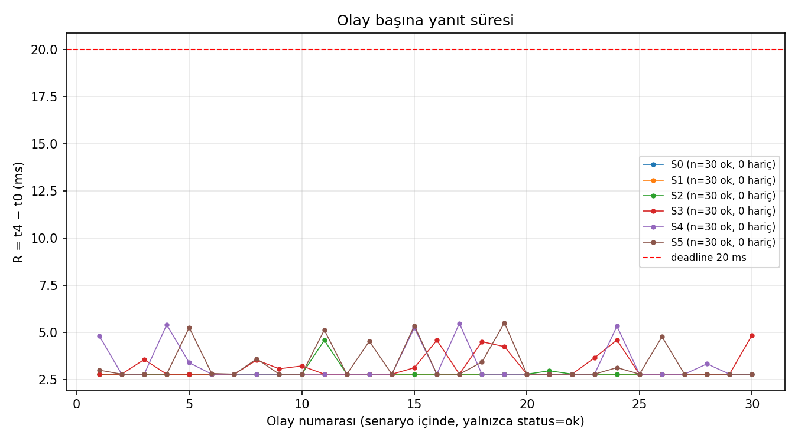
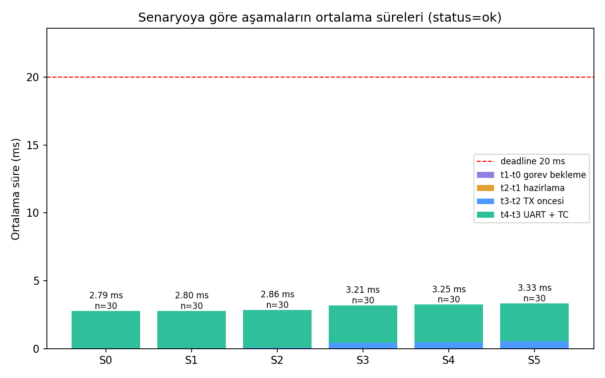

# Analiz Raporu — PressTrace FastPath

- **Ölçüm tarihi:** 27 Eylül 2026, STM32F407VG Discovery, tek kart, 230400 baud, UART hakemi +
  hızlı yol.
- **Ham veri:** [S0.csv](../measurements/S0.csv) … [S5.csv](../measurements/S5.csv), pencere
  sayaçları `S<n>_counters.csv`, özet tablo [summary.csv](../measurements/summary.csv).
- **Üretim:** Tablolar ve grafikler aynı ham CSV'lerden [analyze.py](analyze.py) ile üretildi. Ek
  sayılar (faz, doğrudan / mandal ayrımı, basış aralıkları) da aynı CSV'lerden hesaplandı.
- **Karşılaştırma verisi:**
  - Önceki sürüm: [presstrace-stm32](https://github.com/ardagmrkc/presstrace-stm32), 115200, görev
    tabanlı yanıt yolu, 25 Eylül 2026.
  - Ara ölçüm: 230400, görev tabanlı yol ([ekran görüntüsü](../docs/img/s5_230400_hizli_yol_oncesi.png)).

## 1. Soru

Önceki sürüm, telemetri hızı ve CPU yükü arttıkça `R = t₄ − t₀`'ın hangi aşamada büyüdüğünü
gösterdi. S5'te (100 Hz + 5 ms iş) sistem doyuma girdi. Bu raporun sorusu şu:

**Görev öncelikleri ve baud değişmeden, yanıt yolunun mimarisi değiştirilerek R her senaryoda ne
kadar ve hangi aşamada iyileşir? Geriye ne kalır?**

## 2. Yöntem

### 2.1 Sistem

| Konu | Değer |
|---|---|
| MCU saati | HSE 8 MHz → PLL → SYSCLK 168 MHz; AHB 168, APB1 42, APB2 84 MHz |
| Zaman damgası | TIM2, 32 bit, 1 MHz (84 MHz ÷ 84), serbest koşu; farklar mod 2³² |
| FreeRTOS | V11.1.0+ (`8be86d4`), tick 1 kHz, heap_4 |
| Görev öncelikleri | TelemetryTask 3 > ButtonTask 2 > UartTxTask 1 (**değişmedi**) |
| NVIC | EXTI0 = USART2 = 5, 4 bit preemption (**değişmedi**) |
| UART | USART2, **230400** 8N1 (BRR 11,375 → gerçek 230 769 baud); satır 64 bayt = 2,773 ms |
| Yanıt yolu | **UART hakemi + hızlı yol:** buton satırı EXTI0 kesmesinden hemen ya da TC kesmesinden mandaldan başlatılır; ButtonTask yedek yol |
| Derleme | IAR EWARM 9.70.4, Debug, optimizasyon Low |

### 2.2 Ölçüm noktaları

| Damga | Hızlı yol (bu ölçümün tamamı) |
|---|---|
| t₀ | Filtrenin kabul ettiği basış kenarında EXTI0 kesmesinin ilk işi |
| t₁ | Hızlı yola giriş (aynı kesme) |
| t₂ | Hat kararı öncesi (aynı kesme) |
| t₃ | Satır hatta başlatılmadan hemen önce: hat boşsa EXTI0'da, meşgulse TC kesmesinde |
| t₄ | USART2 TC kesmesinin ilk işi: son stop biti hattan çıktı |

Hızlı yolda `t₁ − t₀` ve `t₂ − t₁` artık görev beklemesi değil, kesme içi mikrosaniyeler. Yanıtın
gecikmesi `t₃ − t₂` (hattın boşalmasını bekleme + satırı hazırlama) ve `t₄ − t₃` (hat) içinde
toplanır.

### 2.3 Prosedür ve istatistik

- **Prosedür:** Her senaryoda 5 s ısınma, 30 basış. Kayıtlar ölçüm sırasında hatta basılmaz,
  pencere sonunda dökülür.
- **Basış aralıkları:**

  | | S0 | S1 | S2 | S3 | S4 | S5 |
  |---|---|---|---|---|---|---|
  | En kısa (s) | 1,15 | 1,11 | 1,50 | 1,33 | 1,28 | 1,59 |
  | Ortanca (s) | 1,44 | 1,60 | 1,69 | 1,58 | 1,72 | 2,23 |

- **İstatistik:** R ve aşamalar yalnızca `status = ok` olaylardan hesaplandı. Bu ölçümde 180
  olayın 180'i `ok`; hariç tutulan kayıt yok.

## 3. Senaryo özeti

### 3.1 R

| Senaryo | Telemetri (nom. / ölçülen) | Ek iş | ok / drop | R min / ort / p95 / maks (ms) | Jitter | > 20 ms | > 5 ms | TX tepe |
|---|---|---|---|---|---|---|---|---|
| S0 | kapalı / — | — | 30 / 0 | 2,794 / 2,796 / 2,798 / 2,798 | 0,004 ms | 0 | 0 | 0 |
| S1 | 10 / 10,00 Hz | — | 30 / 0 | 2,794 / 2,797 / 2,799 / 2,800 | 0,006 ms | 0 | 0 | 1 |
| S2 | 50 / 50,00 Hz | — | 30 / 0 | 2,795 / 2,863 / 2,897 / 4,592 | 1,797 ms | 0 | 0 | 1 |
| S3 | 100 / 100,01 Hz | — | 30 / 0 | 2,796 / 3,208 / 4,602 / 4,865 | 2,069 ms | 0 | 0 | 1 |
| S4 | 100 / 100,01 Hz | 2 ms | 30 / 0 | 2,796 / 3,247 / 5,379 / 5,488 | 2,692 ms | 0 | 4 | 2 |
| S5 | 100 / 100,01 Hz | 5 ms | 30 / 0 | 2,796 / 3,326 / 5,318 / 5,514 | 2,718 ms | 0 | 4 | 2 |

### 3.2 Aşama ortalamaları (ms)

| Senaryo | t₁−t₀ | t₂−t₁ | t₃−t₂ | t₄−t₃ | Toplam = R ort |
|---|---|---|---|---|---|
| S0 | 0,001 | < 0,001 | 0,017 | 2,777 | 2,796 |
| S1 | 0,001 | < 0,001 | 0,018 | 2,777 | 2,797 |
| S2 | 0,001 | < 0,001 | 0,084 | 2,778 | 2,863 |
| S3 | 0,001 | < 0,001 | 0,428 | 2,778 | 3,208 |
| S4 | 0,001 | < 0,001 | 0,468 | 2,778 | 3,247 |
| S5 | 0,001 | < 0,001 | 0,547 | 2,778 | 3,326 |

Aşamaların aralıkları:
- `t₁ − t₀`: her senaryoda 1–2 µs.
- `t₂ − t₁`: 0–1 µs.
- `t₄ − t₃`: 2775–2781 µs.
- `t₃ − t₂`: hat boşken 17–19 µs, mandalda en fazla 2,73 ms.

### 3.3 Hızlı yolun iki kolu

| Senaryo | Hemen başlayan (hat boştu) | R (ms) | Mandaldan başlayan (hatta TEL vardı) | R (ms) | Mandal bekleme `t₃ − t₂` (ms) |
|---|---|---|---|---|---|
| S0 | 30 | 2,794 – 2,798 | 0 | — | — |
| S1 | 30 | 2,794 – 2,800 | 0 | — | — |
| S2 | 28 | 2,795 – 2,800 | 2 | 2,976 – 4,592 | 0,19 – 1,81 |
| S3 | 19 | 2,796 – 2,800 | 11 | 3,082 – 4,865 | 0,30 – 2,08 |
| S4 | 23 | 2,796 – 2,799 | 7 | 3,345 – 5,488 | 0,56 – 2,71 |
| S5 | 19 | 2,796 – 2,800 | 11 | 2,833 – 5,514 | 0,05 – 2,73 |

**İşin içindeki basışlar:** S5'te mandaldan başlayan satırların t₃'ü, yani önceki TEL'in bittiği
an, 10 ms'lik sayaçta 6869–6873 µs fazında; periyot ±2 µs içinde kilitli. Bu fazdan geri
hesaplanan 5 ms'lik iş penceresine göre hemen başlayan 19 basışın **14'ü işin içinde** geldi; R
2,796–2,800 ms. S4'te 23 basışın 6'sı 2 ms'lik işin içindeydi; R 2,796–2,799 ms. Pencere sınırları
tahmindir (birkaç on µs hata payı), ama sonucu değiştirmez: hemen başlayan hiçbir basış 2,800
ms'yi aşmadı.

### 3.4 Kayıp ve bütünlük

| Senaryo | accepted | direct + latched | fallback | result_lost | tx_queue_drop | tx_timeout / start_fail / spurious_tc | REC alınan / beklenen | Sıra boşluğu / hatalı satır | repeat |
|---|---|---|---|---|---|---|---|---|---|
| S0 | 30 | 30 + 0 | 0 | 0 | 0 | 0 / 0 / 0 | 30 / 30 | 0 / 0 | 45 |
| S1 | 30 | 30 + 0 | 0 | 0 | 0 | 0 / 0 / 0 | 30 / 30 | 0 / 0 | 44 |
| S2 | 30 | 28 + 2 | 0 | 0 | 0 | 0 / 0 / 0 | 30 / 30 | 0 / 0 | 84 |
| S3 | 30 | 19 + 11 | 0 | 0 | 0 | 0 / 0 / 0 | 30 / 30 | 0 / 0 | 99 |
| S4 | 30 | 23 + 7 | 0 | 0 | 0 | 0 / 0 / 0 | 30 / 30 | 0 / 0 | 65 |
| S5 | 30 | 19 + 11 | 0 | 0 | 0 | 0 / 0 / 0 | 30 / 30 | 0 / 0 | 94 |

Tutarlılık: CSV'de hattı bekleyen olay sayısı (`t₃ − t₂` > 100 µs) mandal sayacıyla eşleşiyor. Tek
fark S5'teki 156 numaralı olay: mandal kuruldu ama TEL'in bitmesine yalnızca 51 µs kalmıştı.

### 3.5 Telemetri üretimi

| Senaryo | Gönderilen TEL | Periyot en kısa / ort / en uzun (µs) |
|---|---|---|
| S1 | 543 | 99 778 / 99 999 / 100 001 |
| S2 | 2965 | 19 904 / 19 999 / 20 017 |
| S3 | 5789 | 9 843 / 9 999 / 10 002 |
| S4 | 5738 | 9 709 / 9 999 / 10 001 |
| S5 | 8014 | 9 645 / 9 999 / 10 001 |

- Ortalama periyot nominal değerde.
- En uzun periyot nominalden en fazla +17 µs sapıyor. Bu, kesmeye eklenen iş (satırı hazırlayıp
  başlatmak, ~17 µs) ile uyumlu.
- En kısa değer yalnızca pencerenin ilk periyodu: senaryo seçilince görev tick'in ortasında uyanır.

## 4. Grafikler

Olay numarası → R, 20 ms çizgisi. Bütün noktalar 2,79–5,51 ms bandında. Taban 2,80 ms'deki düz
çizgi hemen başlayan basışlar, üstündeki sıçramalar mandaldan başlayan basışlar.

Senaryo → aşama ortalamaları, yığılmış sütun. Hat süresi (yeşil) sabit; telemetri hızıyla büyüyen
tek aşama `t₃ − t₂` (mavi); görev bekleme (mor) görünmüyor.

## 5. Beklenti ve ölçüm

| Beklenti | Hesap | Ölçüm | Sonuç |
|---|---|---|---|
| Hemen başlayan basışta R ≈ kesme işi + satır | ~0,02 + 2,773 = ~2,79 ms | 2,794 – 2,800 ms | Tuttu |
| Ek iş hemen başlayan basışı etkilemez | İş sırasında hat boş, kesme görev önceliğinden bağımsız | S5'te işin içindeki 14 basış 2,796–2,800 ms | Tuttu |
| Mandal oranı ≈ hat doluluğu | 230400'de %13,9 (S2) / %27,8 (S3–S5) → 4,2 / 8,3 | 2 / 11 / 7 / 11 | 30 örnek için uyumlu |
| Mandalda R ≤ iki satır süresi | 2 × 2,78 + ~0,02 = ~5,58 ms | en büyük 5,514 ms | Tuttu |
| Bayt karışması yok | Hakem değişmezleri (D1–D4) | sıra boşluğu 0, hatalı satır 0 | Tuttu |
| Telemetri periyodu korunur | Görev öncelikleri değişmedi | ort. 9 999 µs, en uzun +17 µs | Tuttu |
| S5'te > 5 ms olasılığı | Basış TEL'in ilk ~0,6 ms'ine denk gelirse; 30 basışta ~2 | S4'te 4, S5'te 4 | Beklenenden biraz fazla; 30 örnekle ayırt edilemez |

## 6. Sonuç ve yorum

### 6.1 Hangi bileşen değişti?

| Aşama | PressTrace 115200 (S5) | FastPath 230400 (S5) |
|---|---|---|
| `t₁ − t₀` görev bekleme | ort. 1,55 ms, en çok 4,67 ms | **0,001 ms** (1–2 µs) |
| `t₃ − t₂` TX öncesi | ort. 106,5 ms, en çok 159,7 ms | **0,55 ms** ort., en çok 2,73 ms |
| `t₄ − t₃` hat | 5,570 ms | **2,778 ms** |
| R | 29,4 – 165,3 ms, 10 drop | **2,80 – 5,51 ms, 0 drop** |

- Görev beklemesi tamamen ortadan kalktı.
- TX öncesi bekleme en fazla bir satır süresine indi.
- Hat süresi baud ile yarıya indi.

### 6.2 Neden?

- **Hat süresi (baud):** 230400'de 5 + 2,78 < 10 ms. S5'teki doyum koşulu kalktı; satır bir
  sonraki iş başlamadan bitiyor.
- **Görev bekleme (hızlı yol):** Buton satırı artık ButtonTask'ı ve UartTxTask'ı beklemiyor. EXTI0
  kesmesi NVIC düzleminde çalışıyor ve iş sürerken boş olan hatta satırı hemen başlatıyor.
- **FIFO sırası (hakem):** TC kesmesi mandaldaki butonu görevi uyandırmadan önce başlatıyor. Görev
  mandal varken hattı alamıyor; buton, TEL'in arkasına düşmüyor.
- **Kalan jitter:** Tek kaynak, basış anında hatta zaten başlamış bir TEL satırı. Satır yarıda
  kesilemediği için bu, bu baud ve satır biçimindeki fiziksel alt sınır.

### 6.3 Hangi ölçüm destekliyor?

- **Görev bekleme yok:** `t₁ − t₀` = 1–2 µs, altı senaryoda da (önceki sürümde S5'te 4,67 ms'ye
  kadar).
- **Yükten bağımsız yanıt:** Hemen başlayan basışlarda R = 2,794–2,800 ms, altı senaryoda da.
  Faz analizine göre S5'te bunların 14'ü 5 ms'lik işin içindeydi.
- **Kalan jitter'ın kaynağı:** Mandaldan başlayan basışlarda `t₃ − t₂` = 0,05–2,73 ms, yani en
  fazla bir satır; mandal sayacı CSV'deki bekleme olaylarıyla eşleşiyor.
- **Baytlar karışmadı, sıra bozulmadı:** Sıra boşluğu 0, hatalı satır 0, `tx_start_fail` 0.
  `btn_direct + btn_latched = accepted`.
- **Telemetri korunuyor:** Ortalama periyot 9 999 µs, en uzun +17 µs.
- **Mantık doğrulaması:** Bilgisayar testi ([tests/host](../tests/host/)) 8 senaryonun 8'ini
  geçti.

### 6.4 Ne henüz bilinmiyor?

- **Yedek yol ve kurtarma yolları kartta hiç çalışmadı.** Yedek yol (`btn_fallback` = 0), takılma
  kurtarma ve zaman aşımı yolları yalnızca bilgisayar testinde doğrulandı. Bir satır süresi
  içinde iki basış gerektiren bir test kartta yapılmadı.
- **Hızlı yolun 115200'deki davranışı ölçülmedi.** Beklenen: hemen başlayan basışta ~5,6 ms,
  mandalda en fazla ~11,1 ms.
- **5 ms'yi aşma olasılığı dar ölçüldü.** S4 ve S5'te gözlenen 4/30, hesaplanan ~2/30'dan fazla;
  daha çok basışla netleşir.
- **Release derlemede kesme maliyeti ölçülmedi.**
- **Kanıtlanmış en kötü durum yok;** 30 örnekle gözlenen en büyük değer var.

## 7. Sınırlamalar

- Gözlenen maksimum, kanıtlanmış en kötü durum değildir.
- t₀ fiziksel basma anı değildir; t₃ ilk fiziksel bit değildir; t₄'e TC kesmesine giriş gecikmesi
  dahildir.
- Hızlı yolda t₁ ve t₂ kesme içinde alınır; önceki sürümün `t₁ − t₀` (görev bekleme) tanımıyla
  doğrudan karşılaştırılamaz. Karşılaştırma R ve `t₃ − t₀` üzerinden yapılmalıdır.
- Baud 230400'dür; ödev şartnamesinin tabanı ve önceki sürümün ölçümleri 115200'dür.
  İyileşmenin bir kısmı (hat süresinin yarıya inmesi ve doyumun kalkması) baud'dan, bir kısmı
  (görev bekleme ve FIFO beklemesinin kalkması) mimariden gelir. Ara ölçüm bu ikisini ayırır:
  230400'de görev tabanlı yolla S5 R'si 2,81–8,73 ms'ydi.
- `tx_queue_max`, TX kuyruğundan geçen hızlı yol sonuç mesajlarını (`MSG_BTN_DONE`) da sayabilir.
- Osiloskop / mantık analizörüyle bağımsız doğrulama yapılmadı.
- Tüm ölçümler tek kartta, Debug / Low derlemeyle, senaryo başına 30 basışla alındı.
